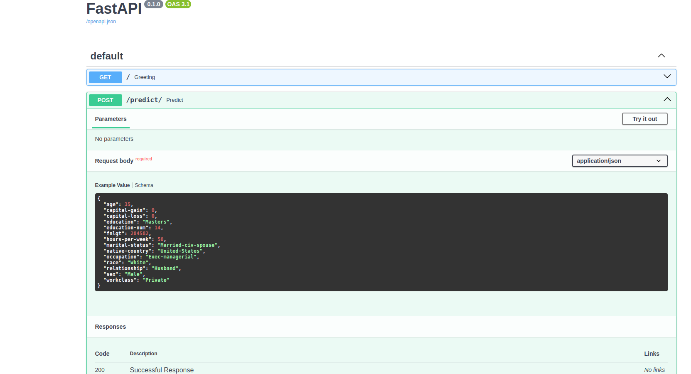

# Deploying a ML Model to Cloud Application Platform with FastAPI

In this project, you will apply the skills acquired in this course to develop a classification model on publicly available Census Bureau data. You will create unit tests to monitor the model performance on various data slices. Then, you will deploy your model using the FastAPI package and create API tests. The slice validation and the API tests will be incorporated into a CI/CD framework using GitHub Actions.

Two datasets will be provided in the starter code on the following page to experience updating the dataset and model in git.

## Project Overview

### Features:
1. **Data Processing**

2. **Model Training and Validation**

3. **API Deployment**:
   - Deploying the trained model using FastAPI.
   - Creating GET and POST endpoints for the API.
   - Providing automatic documentation using FastAPI's built-in features.

4. **Testing**:

5. **Continuous Integration**:
   - Using GitHub Actions.

6. **Continuous Deployment**:
    - Deploying the FastAPI application to Heroku.

## Project Repository

Find the full code and instructions in the [GitHub repository](https://github.com/efigueira/udacity-mlops-course4-fastapi-project).

## Installation Instructions

### Clone the Repository:
```bash
git clone https://github.com/efigueira/udacity-mlops-course4-fastapi-project.git
cd udacity-mlops-course4-fastapi-project
```

### Set Up a Python Environment:
```bash
conda create -n mlops-env python=3.8 -y
conda activate mlops-env
pip install -r requirements.txt
```

### Run the API Locally:
To start the API, run:
```bash
python main.py
```
The API will be available at [http://0.0.0.0:8000](http://0.0.0.0:8000).

### Access the Documentation:
FastAPI automatically generates API documentation. Access it at:
- [Swagger UI](http://0.0.0.0:8000/docs)
- [ReDoc](http://0.0.0.0:8000/redoc)

## Example API Screenshot

Deployed API running locally:



## Testing the Project

### Unit Tests:
To run the unit tests:
```bash
pytest test/
```
### Slice Validation:
Run the slice validation script to evaluate the model's performance on slices of categorical data.
```bash
python src/slices.py
```

## CI/CD with GitHub Actions

The project integrates slice validation and API tests into a CI/CD framework using GitHub Actions. The pipeline includes:
- Running unit tests.
- Testing API endpoints.
